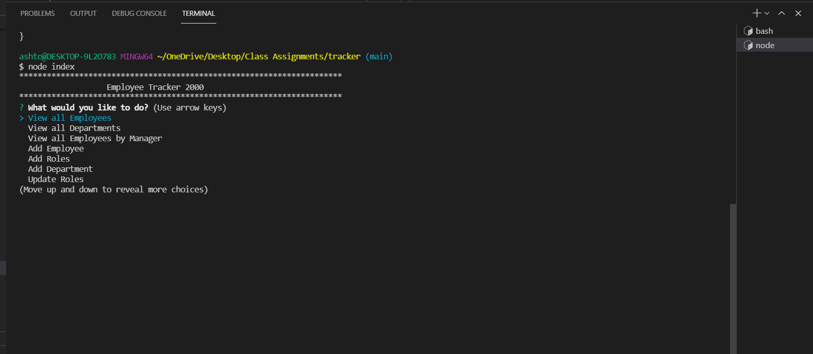

# Employee Tracker

  
[](https://opensource.org/licenses/mit)
  
## Description
this is a app that will allow you to track your employees and salarys 
  
## Table of Contents
- [Installation](#installation)
- [Usage](#usage)
- [Screenshots](#screenshot)
- [Links](#links)
- [Test](#test)
- [License](#license)
- [Questions](#questions)
  
## Installation
```md
run npm i and set up your database. install preseeded data or start inserting your own
```
  
## Usage
```md
select the option from the list and follow the prompts
```
  
## Screenshot

## Links
https://github.com/ashiemotto/tracker
https://drive.google.com/file/d/1xN9Yyrj9Jw2XwL8KMycpQpROCkvl5SAV/view?usp=sharing

  
## Reporting
```md
via email or github
```
## License
[](https://opensource.org/licenses/mit)
  
## Questions a
Add an issue through GitHub:
 https://github.com/ashiemotto
  
Or using email:
Email: ashheadley@gmail.com

